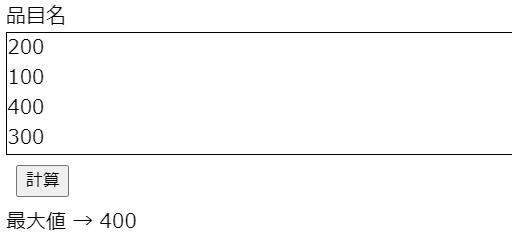

# 問題1_2


## 問題ページ
↓のページを開いてください。  
https://codesandbox.io/s/q-1-2-idqbe?file=/src/App.js


以下のコメントで囲まれた箇所にコードを記述してください。

```console
// ここに処理を追加してください。start

// ここに処理を追加してください。end
```


## 内容
temListの中で最大の値を求めて下さい。

操作例  
「計算」ボタンをクリックすると、最大値に400と表示される。  



itemListの中身が変更されても動作するようにして下さい。   
例えばitemListを以下のように変更し、最大値が求まるか確認してみましょう。  

```console
//例
const itemList = [1000, 200, 1, 10, 999, 1001 ];
```


## ヒント
・for文とif文を使ってみましょう。  
・リストの要素数は```itemList.length```で取得できます。  


## 回答例
問題が解けた後、またはどうしても解けない場合に確認してください。  
https://codesandbox.io/s/q-1-2-answer-7xstx?file=/src/App.js
