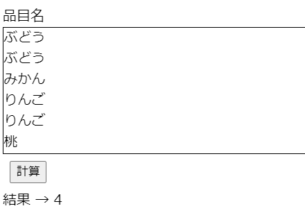

# 問題1_3


## 問題ページ
↓のページを開いてください。  
https://codesandbox.io/s/q-1-3-kb85b?file=/src/App.js


以下のコメントで囲まれた箇所にコードを記述してください。

```console
// ここに処理を追加してください。start

// ここに処理を追加してください。end
```


## 内容
itemListに含まれる値の種類数を求めて下さい。
itemListはソート済みとします。

操作例  
「計算」ボタンをクリックすると、結果に4と表示される。  
（りんご、みかん、ぶどう、桃　の4種類）



itemListの中身が変更されても動作するようにして下さい。   
例えばitemListを以下のように変更し、値が求まるか確認してみましょう。  

```console
//例
const itemList = ["オレンジ", "オレンジ", "パイン", "キウイ", "キウイ", "キウイ"];
```


## ヒント
・for文とif文を使ってみましょう。  
・リストの要素数は```itemList.length```で取得できます。  


## 回答例
問題が解けた後、またはどうしても解けない場合に確認してください。  
https://codesandbox.io/s/q-1-3-answer-rm4rk?file=/src/App.js
