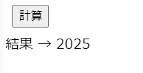

# 問題1_4


## 問題ページ
↓のページを開いてください。  
https://codesandbox.io/s/q-1-4-v915b?file=/src/App.js

以下のコメントで囲まれた箇所にコードを記述してください。

```console
// ここに処理を追加してください。start

// ここに処理を追加してください。end
```


## 内容
九九の結果を全て合算した値を求めて下さい。  
 1×1 + 1×2 + ・・・ + 9×8 + 9×9
 
「計算」ボタンをクリックし、結果に2025と表示されれば正常に計算できています。 




正解出来たら、10や11までの合算をした値も求めてみましょう。  
 例）1×1 + 1×2 + ・・・ + 9×8 + 9×9 + 10×1 + 10×2 + ・・・* 10×10


## ヒント
・for文を複数使ってみましょう。  


## 回答例
問題が解けた後、またはどうしても解けない場合に確認してください。  
https://codesandbox.io/s/q-1-4-answer-kt4ow?file=/src/App.js
