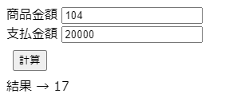

# 問題2_1


## 問題ページ
↓のページを開いてください。  
https://codesandbox.io/s/q-2-1-ylloh

以下のコメントで囲まれた箇所にコードを記述してください。

```console
// ここに処理を追加してください。start

// ここに処理を追加してください。end
```


## 内容
商品金額と支払金額を入力し、お釣りとして渡すお札・硬貨の最小の枚数を求めて下さい。  
お釣りとして使用できる金額は以下になります。  
10000, 5000, 1000, 500, 100, 50, 10, 1
 
  例1）  
 商品金額 → 29円  
 支払金額 → 100円  

 結果：4枚

お釣りは71円なので、

50: 1枚、
10: 2枚、
1:  1枚
が最小

 例2）  
 商品金額 → 104円  
 支払金額 → 20000円  

 
結果：17枚

お釣りは19896円なので、

10000: 1枚、
5000: 1枚、
1000: 4枚、
500: 1枚、
100: 3枚、
50: 1枚、
10: 4枚、
5: 1枚、
1: 1枚
が最小




  
使用できる通貨に2000円札が追加された場合でも簡単に修正できるように作成してみましょう。


## ヒント
・配列を定義してみましょう  


## 回答例
問題が解けた後、またはどうしても解けない場合に確認してください。  
https://codesandbox.io/s/q-2-1-answer-rm5ir
